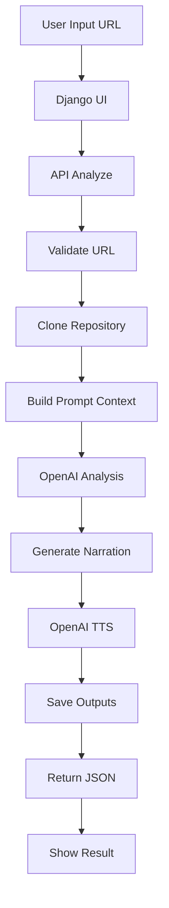
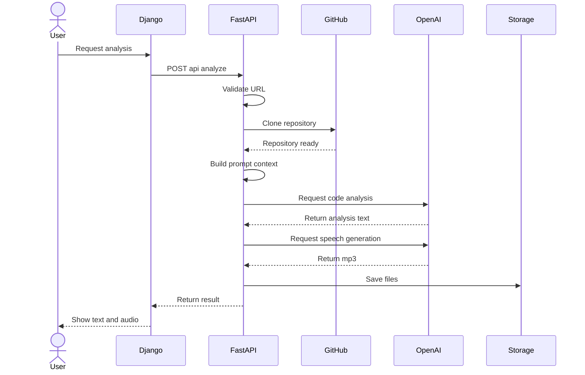
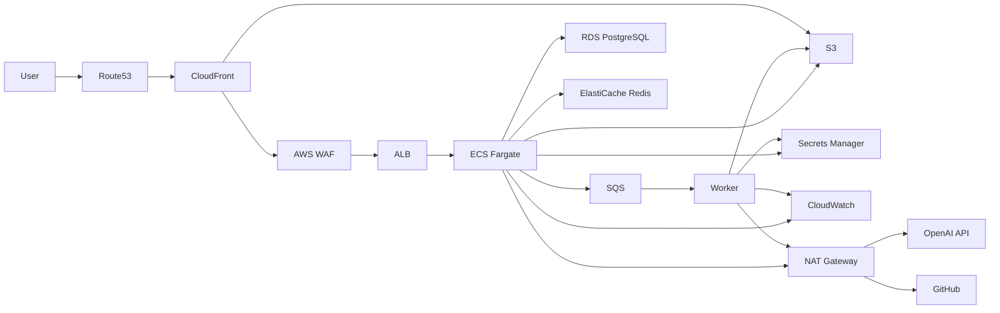
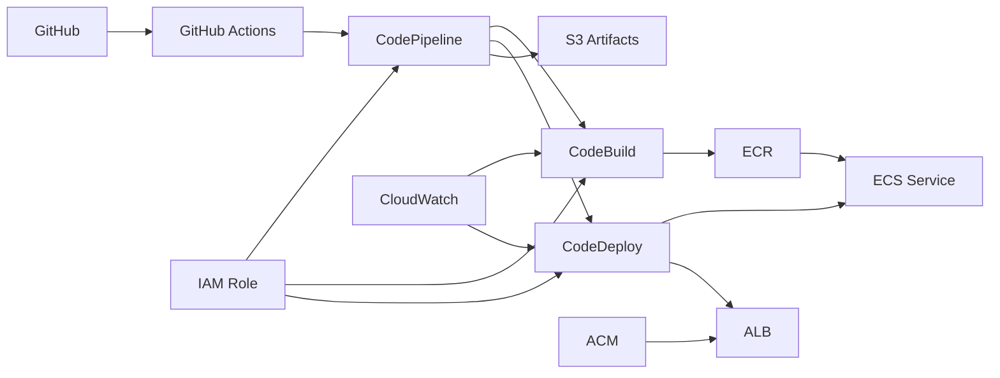

# Django + FastAPI GitHub Repo Voice Analyzer

### test

입력한 GitHub public 저장소 URL을 기준으로:
1. 저장소를 로컬 폴더에 클론
2. OpenAI로 코드 구조/기술 내용을 분석
3. 분석 내용을 OpenAI TTS로 MP3 파일 생성

을 자동 처리하는 웹 애플리케이션입니다.

## 프로젝트 개요
- 목적: 개발자가 GitHub 공개 저장소를 빠르게 이해할 수 있도록 코드 분석 결과를 텍스트와 음성으로 제공
- 입력: GitHub public 저장소 URL (`https://github.com/{owner}/{repo}`)
- 처리: 저장소 클론, 핵심 파일 샘플링, LLM 기술 분석, 내레이션 스크립트 생성, MP3 변환
- 출력: 분석 텍스트(`.md`)와 음성 파일(`.mp3`), 웹 UI에서 재생/다운로드 링크 제공

## 기술 스택
- Language: `Python 3`
- Web UI: `Django`
- API Layer: `FastAPI`
- ASGI Server: `Uvicorn`
- AI Analysis/TTS: `OpenAI API` (`chat.completions`, `audio.speech`)
- Repo Ingestion: `git clone --depth 1`
- Config: `.env`, `.env.local`, `.env.dev`, `.env.prod`, `python-dotenv`
- Storage: 로컬 파일시스템 (`workspace_repos/`, `media/outputs/`)

## 아키텍처
- `Django`: 웹 화면(UI) 제공
- `FastAPI`: `/api/*` 분석 API 제공
- `OpenAI API`: 코드 분석 + 음성 생성

FastAPI 앱에서 Django ASGI 앱을 `/`에 마운트해 단일 서버로 실행합니다.

## Mermaid Flow


## Mermaid Sequence


## 프로젝트 구조
```text
repo_voice_analyzer/
  settings.py
  urls.py
  asgi.py
  fastapi_app.py
dashboard/
  views.py
  urls.py
  templates/dashboard/index.html
services/
  pipeline.py
manage.py
requirements.txt
.env.example
.env.local.example
.env.dev.example
.env.prod.example
deploy/gitops/environments/
```

## 설치
```bash
python3 -m venv .venv
source .venv/bin/activate
pip install -r requirements.txt
cp .env.example .env
cp .env.local.example .env.local
```

`APP_ENV`에 따라 `.env.local/.env.dev/.env.prod`가 자동 로드됩니다.
기본값은 `APP_ENV=local` 입니다.

## 실행
```bash
uvicorn repo_voice_analyzer.fastapi_app:app --reload --host 0.0.0.0 --port 8000
```

## Docker 실행
환경 파일을 준비한 뒤 Docker Compose로 실행할 수 있습니다.

```bash
cp .env.local.example .env.local
# .env.local 파일에서 OPENAI_API_KEY 설정
docker compose --env-file .env.local up -d --build
```

중지:
```bash
docker compose down
```

## 환경 분리 (`local` / `dev` / `prod`)

### 로컬 실행
```bash
cp .env.local.example .env.local
APP_ENV=local uvicorn repo_voice_analyzer.fastapi_app:app --reload --host 0.0.0.0 --port 8000
```

### 개발 환경 실행
```bash
cp .env.dev.example .env.dev
APP_ENV=dev uvicorn repo_voice_analyzer.fastapi_app:app --host 0.0.0.0 --port 8000
```

### 운영 환경 실행
```bash
cp .env.prod.example .env.prod
APP_ENV=prod uvicorn repo_voice_analyzer.fastapi_app:app --host 0.0.0.0 --port 8000
```

### Docker로 환경별 실행
```bash
docker compose --env-file .env.local up -d --build
docker compose --env-file .env.dev up -d --build
docker compose --env-file .env.prod up -d --build
```

브라우저:
- UI: `http://127.0.0.1:8000/`
- Health: `http://127.0.0.1:8000/api/health`
- API Docs: `http://127.0.0.1:8000/docs`

## API 예시
`POST /api/analyze`

요청:
```json
{
  "repo_url": "https://github.com/openai/openai-python"
}
```

응답:
```json
{
  "job_id": "f0f6aee245e644f2a7a7f513b7ea7ac1",
  "repository": "openai/openai-python",
  "local_path": "/home/Python-Google-TTS/workspace_repos/openai__openai-python__f0f6aee2",
  "analysis_text": "...",
  "narration_text": "...",
  "audio_url": "/media/outputs/f0f6aee245e644f2a7a7f513b7ea7ac1.mp3",
  "analysis_url": "/media/outputs/f0f6aee245e644f2a7a7f513b7ea7ac1.md"
}
```

## 동작 흐름
1. GitHub URL 유효성 검사 (`github.com/{owner}/{repo}`만 허용)
2. `git clone --depth 1`로 로컬 폴더 생성/클론
3. 코드 파일 일부를 샘플링해 프롬프트 컨텍스트 구성
4. OpenAI 모델로 기술 분석 + TTS용 내레이션 생성
5. OpenAI 음성 API로 MP3 파일 생성
6. `/media/outputs`에 분석 문서/오디오 저장

## 주의사항
- public 저장소만 지원합니다.
- 저장소가 너무 크면 분석 시간이 길어질 수 있습니다.
- OpenAI API 사용 비용이 발생할 수 있습니다.

---

# AWS 배포 아키텍처 가이드 (Voice Analyzer)

이 문서는 **AI-Django-FastAPI-GitHub-Repo-VoiceAnalyzer**를 AWS에 안정적으로 배포하기 위해 필요한 리소스와 권장 구성을 정리한 문서입니다.

---

## 1) 권장 AWS 아키텍처 구성도 (2분할)

`Mermaid 10.9.3` 파싱 안정성과 가독성을 위해 `런타임`과 `CI/CD`를 분리했습니다.
SVG는 화살표를 카드 뒤 레이어에 배치해 아이콘 가림을 최소화했습니다.

### 1-1) Runtime/Data Plane




### 1-2) CI/CD Control Plane (Full CodePipeline)




---

## 2) 리소스별 역할 정리

### 네트워크/엣지
- **Route 53**: 도메인/서브도메인 라우팅.
- **CloudFront**: 전역 캐시, TLS, 정적 콘텐츠 가속.
- **Internet Gateway**: VPC 인바운드/아웃바운드 인터넷 연결 지점.
- **ALB**: HTTPS 트래픽 수신 후 Django/FastAPI 앱으로 전달.
- **NAT Gateway**: Private Subnet의 외부 API(OpenAI, GitHub) 아웃바운드 통신.
- **VPC + 멀티 AZ + 서브넷 분리**: 보안성과 가용성 확보.

### 애플리케이션 실행
- **ECS Fargate**: 서버 관리 없이 컨테이너 실행.
  - 컨테이너 1: Django (웹/템플릿/관리)
  - 컨테이너 2: FastAPI (API/모델 추론)
  - 필요 시 하나의 이미지에 프로세스 분리도 가능하나, 운영 측면에서 서비스 분리가 유리.
- **ECR**: 버전별 이미지 저장소.

### 데이터/스토리지
- **RDS PostgreSQL**: 사용자/분석 이력/업무 데이터.
- **S3**: 업로드 음성 파일, 변환 MP3, 분석 결과(JSON/CSV), Django 정적 파일.
- **ElastiCache Redis**: 캐시, 세션, Celery 브로커/결과 백엔드.
- **SQS (선택 권장)**: 음성 분석 파이프라인 비동기 큐.

### 보안/운영
- **Secrets Manager**: OpenAI 키, DB 비밀번호, OAuth 비밀값.
- **IAM Role**: ECS Task 최소권한 원칙 적용.
- **CloudWatch**: 로그/메트릭/알람.
- **AWS WAF (선택)**: 웹 공격 차단.
- **AWS Backup (선택)**: RDS 스냅샷 및 복구 정책.

### CI/CD
- **GitOps + GitHub Actions + AWS CodePipeline (Full)**:
  1. Git에 선언된 환경 프로필(`deploy/gitops/environments/*.json`)을 단일 소스로 사용
  2. 브랜치(`develop`/`main`)에 맞는 환경(`dev`/`prod`) 자동 매핑
  3. CodePipeline 실행 전 CodeBuild/CodeDeploy 스테이지 유효성 검증
  4. CodeBuild에서 빌드/테스트 및 ECR 푸시
  5. CodeDeploy로 ECS 배포(Blue/Green 또는 Rolling)

### GitHub Actions 워크플로우 파일
- **파일**: `.github/workflows/codepipeline-full.yml`
- **동작**:
  1. `develop` push -> `dev` 프로필, `main` push -> `prod` 프로필 적용
  2. 수동 실행(`workflow_dispatch`) 시 `local/dev/prod` 선택 가능
  3. GitOps 프로필에서 `aws_region`, `codepipeline_name`, `wait_for_completion` 로드
  4. 파이프라인에 **CodeBuild + CodeDeploy** 포함 여부 검증
  5. 파이프라인 실행 및 완료 상태 대기(옵션)
- **GitOps Profile**
  - `deploy/gitops/environments/dev.json`
  - `deploy/gitops/environments/prod.json`
  - `deploy/gitops/environments/local.json`
- **Repository Variables**
  - `AWS_REGION` (fallback, 예: `ap-northeast-2`)
  - `CODEPIPELINE_NAME` (fallback, 예: `voice-analyzer-full`)
- **Repository Secrets**
  - 권장: `AWS_GITHUB_ROLE_ARN` (OIDC AssumeRole)
  - 대체: `AWS_ACCESS_KEY_ID`, `AWS_SECRET_ACCESS_KEY`

### GitOps 운영 흐름
1. 배포 목표 상태를 `deploy/gitops/environments/*.json`에서 수정
2. Pull Request로 변경 이력/리뷰를 남긴 뒤 승인
3. `develop` 또는 `main` 머지 시 환경에 맞는 CodePipeline 자동 실행
4. 런타임 인프라 상태와 Git 선언 상태를 동기화

---

## 3) 기술 스택 (배포 관점)

### 애플리케이션
- **Python**
- **Django** (웹/관리 화면)
- **FastAPI** (고성능 API)
- **Uvicorn/Gunicorn** (ASGI/WSGI 런타임)

### AI/오디오 처리
- **OpenAI API 연동** (음성/텍스트 분석)
- **커스텀 파이프라인 (`services/pipeline.py`)**

### 인프라/운영
- **Docker / Docker Compose (로컬 개발)**
- **AWS ECS Fargate + ECR**
- **RDS PostgreSQL / S3 / ElastiCache Redis / SQS**
- **CloudFront / Route 53 / ALB / VPC**
- **CloudWatch / Secrets Manager / IAM / (선택) WAF**

### CI/CD
- **GitOps + GitHub Actions + AWS CodePipeline(CodeBuild/CodeDeploy)** 기반 빌드/배포 자동화

---

## 4) 권장 배포 전략

- **Blue/Green 또는 Rolling 배포**를 기본으로 사용.
- `main` 브랜치 머지 시 자동 배포, `develop`은 스테이징으로 배포.
- 헬스체크(`/health`) 기반 무중단 배포.
- 장애 대비:
  - RDS 멀티 AZ
  - S3 버저닝
  - CloudWatch 알람 + 자동 롤백

---

## 5) AWS CLI 배포 스크립트 (`Bash`)

아래 스크립트는 이 문서의 아키텍처를 기준으로 **한 번에 기본 인프라를 생성**합니다.

- 생성 대상: `VPC/서브넷/IGW/NAT`, `ALB`, `ECS Fargate`, `ECR`, `S3`, `SQS`, `Secrets Manager`, `CloudWatch`, `IAM Role`
- 선택 대상: `RDS`, `ElastiCache` (스크립트 하단 옵션 블록)
- 전제:
  - `aws cli v2`, `jq`, `docker` 설치
  - AWS 자격증명 설정 완료 (`aws configure` 또는 SSO)
  - 루트에서 실행 (`Dockerfile` 기준 이미지 빌드)

```bash
#!/usr/bin/env bash
set -euo pipefail

#######################################
# 0) 환경 변수
#######################################
PROJECT_NAME="${PROJECT_NAME:-voice-analyzer}"
AWS_REGION="${AWS_REGION:-ap-northeast-2}"
AZ1="${AZ1:-${AWS_REGION}a}"
AZ2="${AZ2:-${AWS_REGION}c}"

VPC_CIDR="${VPC_CIDR:-10.20.0.0/16}"
PUB1_CIDR="${PUB1_CIDR:-10.20.0.0/24}"
PUB2_CIDR="${PUB2_CIDR:-10.20.1.0/24}"
APP1_CIDR="${APP1_CIDR:-10.20.10.0/24}"
APP2_CIDR="${APP2_CIDR:-10.20.11.0/24}"
DATA1_CIDR="${DATA1_CIDR:-10.20.20.0/24}"
DATA2_CIDR="${DATA2_CIDR:-10.20.21.0/24}"

CONTAINER_PORT="${CONTAINER_PORT:-8000}"
CPU_UNITS="${CPU_UNITS:-512}"
MEMORY_MB="${MEMORY_MB:-1024}"
DESIRED_COUNT="${DESIRED_COUNT:-2}"
IMAGE_TAG="${IMAGE_TAG:-latest}"

OPENAI_API_KEY="${OPENAI_API_KEY:?OPENAI_API_KEY is required}"
DB_PASSWORD="${DB_PASSWORD:-ChangeMe_123!}"
CERT_ARN="${CERT_ARN:-}" # optional: HTTPS listener 사용 시 지정

ACCOUNT_ID="$(aws sts get-caller-identity --query Account --output text)"
export AWS_PAGER=""

for cmd in aws jq docker; do
  command -v "${cmd}" >/dev/null || { echo "[ERROR] ${cmd} not found"; exit 1; }
done

echo "[INFO] region=${AWS_REGION}, account=${ACCOUNT_ID}, project=${PROJECT_NAME}"

#######################################
# 1) 네트워크 (VPC, Subnet, IGW, NAT)
#######################################
VPC_ID="$(aws ec2 create-vpc \
  --region "${AWS_REGION}" \
  --cidr-block "${VPC_CIDR}" \
  --tag-specifications "ResourceType=vpc,Tags=[{Key=Name,Value=${PROJECT_NAME}-vpc}]" \
  --query 'Vpc.VpcId' --output text)"

aws ec2 modify-vpc-attribute --region "${AWS_REGION}" --vpc-id "${VPC_ID}" --enable-dns-support "{\"Value\":true}"
aws ec2 modify-vpc-attribute --region "${AWS_REGION}" --vpc-id "${VPC_ID}" --enable-dns-hostnames "{\"Value\":true}"

PUB1_SUBNET_ID="$(aws ec2 create-subnet --region "${AWS_REGION}" --vpc-id "${VPC_ID}" --cidr-block "${PUB1_CIDR}" --availability-zone "${AZ1}" --tag-specifications "ResourceType=subnet,Tags=[{Key=Name,Value=${PROJECT_NAME}-pub-a}]" --query 'Subnet.SubnetId' --output text)"
PUB2_SUBNET_ID="$(aws ec2 create-subnet --region "${AWS_REGION}" --vpc-id "${VPC_ID}" --cidr-block "${PUB2_CIDR}" --availability-zone "${AZ2}" --tag-specifications "ResourceType=subnet,Tags=[{Key=Name,Value=${PROJECT_NAME}-pub-c}]" --query 'Subnet.SubnetId' --output text)"
APP1_SUBNET_ID="$(aws ec2 create-subnet --region "${AWS_REGION}" --vpc-id "${VPC_ID}" --cidr-block "${APP1_CIDR}" --availability-zone "${AZ1}" --tag-specifications "ResourceType=subnet,Tags=[{Key=Name,Value=${PROJECT_NAME}-app-a}]" --query 'Subnet.SubnetId' --output text)"
APP2_SUBNET_ID="$(aws ec2 create-subnet --region "${AWS_REGION}" --vpc-id "${VPC_ID}" --cidr-block "${APP2_CIDR}" --availability-zone "${AZ2}" --tag-specifications "ResourceType=subnet,Tags=[{Key=Name,Value=${PROJECT_NAME}-app-c}]" --query 'Subnet.SubnetId' --output text)"
DATA1_SUBNET_ID="$(aws ec2 create-subnet --region "${AWS_REGION}" --vpc-id "${VPC_ID}" --cidr-block "${DATA1_CIDR}" --availability-zone "${AZ1}" --tag-specifications "ResourceType=subnet,Tags=[{Key=Name,Value=${PROJECT_NAME}-data-a}]" --query 'Subnet.SubnetId' --output text)"
DATA2_SUBNET_ID="$(aws ec2 create-subnet --region "${AWS_REGION}" --vpc-id "${VPC_ID}" --cidr-block "${DATA2_CIDR}" --availability-zone "${AZ2}" --tag-specifications "ResourceType=subnet,Tags=[{Key=Name,Value=${PROJECT_NAME}-data-c}]" --query 'Subnet.SubnetId' --output text)"

aws ec2 modify-subnet-attribute --region "${AWS_REGION}" --subnet-id "${PUB1_SUBNET_ID}" --map-public-ip-on-launch
aws ec2 modify-subnet-attribute --region "${AWS_REGION}" --subnet-id "${PUB2_SUBNET_ID}" --map-public-ip-on-launch

IGW_ID="$(aws ec2 create-internet-gateway --region "${AWS_REGION}" --tag-specifications "ResourceType=internet-gateway,Tags=[{Key=Name,Value=${PROJECT_NAME}-igw}]" --query 'InternetGateway.InternetGatewayId' --output text)"
aws ec2 attach-internet-gateway --region "${AWS_REGION}" --internet-gateway-id "${IGW_ID}" --vpc-id "${VPC_ID}"

PUBLIC_RT_ID="$(aws ec2 create-route-table --region "${AWS_REGION}" --vpc-id "${VPC_ID}" --tag-specifications "ResourceType=route-table,Tags=[{Key=Name,Value=${PROJECT_NAME}-public-rt}]" --query 'RouteTable.RouteTableId' --output text)"
aws ec2 create-route --region "${AWS_REGION}" --route-table-id "${PUBLIC_RT_ID}" --destination-cidr-block 0.0.0.0/0 --gateway-id "${IGW_ID}"
aws ec2 associate-route-table --region "${AWS_REGION}" --route-table-id "${PUBLIC_RT_ID}" --subnet-id "${PUB1_SUBNET_ID}" >/dev/null
aws ec2 associate-route-table --region "${AWS_REGION}" --route-table-id "${PUBLIC_RT_ID}" --subnet-id "${PUB2_SUBNET_ID}" >/dev/null

EIP_ALLOC_ID="$(aws ec2 allocate-address --region "${AWS_REGION}" --domain vpc --query 'AllocationId' --output text)"
NAT_GW_ID="$(aws ec2 create-nat-gateway --region "${AWS_REGION}" --subnet-id "${PUB1_SUBNET_ID}" --allocation-id "${EIP_ALLOC_ID}" --tag-specifications "ResourceType=natgateway,Tags=[{Key=Name,Value=${PROJECT_NAME}-nat}]" --query 'NatGateway.NatGatewayId' --output text)"
aws ec2 wait nat-gateway-available --region "${AWS_REGION}" --nat-gateway-ids "${NAT_GW_ID}"

PRIVATE_RT_ID="$(aws ec2 create-route-table --region "${AWS_REGION}" --vpc-id "${VPC_ID}" --tag-specifications "ResourceType=route-table,Tags=[{Key=Name,Value=${PROJECT_NAME}-private-rt}]" --query 'RouteTable.RouteTableId' --output text)"
aws ec2 create-route --region "${AWS_REGION}" --route-table-id "${PRIVATE_RT_ID}" --destination-cidr-block 0.0.0.0/0 --nat-gateway-id "${NAT_GW_ID}"
for s in "${APP1_SUBNET_ID}" "${APP2_SUBNET_ID}" "${DATA1_SUBNET_ID}" "${DATA2_SUBNET_ID}"; do
  aws ec2 associate-route-table --region "${AWS_REGION}" --route-table-id "${PRIVATE_RT_ID}" --subnet-id "${s}" >/dev/null
done

#######################################
# 2) Security Group
#######################################
ALB_SG_ID="$(aws ec2 create-security-group --region "${AWS_REGION}" --group-name "${PROJECT_NAME}-alb-sg" --description "ALB SG" --vpc-id "${VPC_ID}" --query 'GroupId' --output text)"
APP_SG_ID="$(aws ec2 create-security-group --region "${AWS_REGION}" --group-name "${PROJECT_NAME}-app-sg" --description "ECS APP SG" --vpc-id "${VPC_ID}" --query 'GroupId' --output text)"
RDS_SG_ID="$(aws ec2 create-security-group --region "${AWS_REGION}" --group-name "${PROJECT_NAME}-rds-sg" --description "RDS SG" --vpc-id "${VPC_ID}" --query 'GroupId' --output text)"
REDIS_SG_ID="$(aws ec2 create-security-group --region "${AWS_REGION}" --group-name "${PROJECT_NAME}-redis-sg" --description "Redis SG" --vpc-id "${VPC_ID}" --query 'GroupId' --output text)"

aws ec2 authorize-security-group-ingress --region "${AWS_REGION}" --group-id "${ALB_SG_ID}" --ip-permissions '[{"IpProtocol":"tcp","FromPort":80,"ToPort":80,"IpRanges":[{"CidrIp":"0.0.0.0/0"}]}]'
aws ec2 authorize-security-group-ingress --region "${AWS_REGION}" --group-id "${ALB_SG_ID}" --ip-permissions '[{"IpProtocol":"tcp","FromPort":443,"ToPort":443,"IpRanges":[{"CidrIp":"0.0.0.0/0"}]}]'

aws ec2 authorize-security-group-ingress --region "${AWS_REGION}" --group-id "${APP_SG_ID}" --protocol tcp --port "${CONTAINER_PORT}" --source-group "${ALB_SG_ID}"
aws ec2 authorize-security-group-ingress --region "${AWS_REGION}" --group-id "${RDS_SG_ID}" --protocol tcp --port 5432 --source-group "${APP_SG_ID}"
aws ec2 authorize-security-group-ingress --region "${AWS_REGION}" --group-id "${REDIS_SG_ID}" --protocol tcp --port 6379 --source-group "${APP_SG_ID}"

#######################################
# 3) S3, SQS, CloudWatch, Secret
#######################################
S3_BUCKET="${PROJECT_NAME}-${ACCOUNT_ID}-${AWS_REGION}-assets"
if [[ "${AWS_REGION}" == "us-east-1" ]]; then
  aws s3api create-bucket --bucket "${S3_BUCKET}" >/dev/null
else
  aws s3api create-bucket --region "${AWS_REGION}" --bucket "${S3_BUCKET}" --create-bucket-configuration LocationConstraint="${AWS_REGION}" >/dev/null
fi
aws s3api put-bucket-versioning --region "${AWS_REGION}" --bucket "${S3_BUCKET}" --versioning-configuration Status=Enabled
aws s3api put-public-access-block --region "${AWS_REGION}" --bucket "${S3_BUCKET}" --public-access-block-configuration BlockPublicAcls=true,IgnorePublicAcls=true,BlockPublicPolicy=true,RestrictPublicBuckets=true

SQS_URL="$(aws sqs create-queue --region "${AWS_REGION}" --queue-name "${PROJECT_NAME}-jobs" --query 'QueueUrl' --output text)"
SQS_ARN="$(aws sqs get-queue-attributes --region "${AWS_REGION}" --queue-url "${SQS_URL}" --attribute-names QueueArn --query 'Attributes.QueueArn' --output text)"

LOG_GROUP="/ecs/${PROJECT_NAME}"
aws logs create-log-group --region "${AWS_REGION}" --log-group-name "${LOG_GROUP}" 2>/dev/null || true
aws logs put-retention-policy --region "${AWS_REGION}" --log-group-name "${LOG_GROUP}" --retention-in-days 30

SECRET_NAME="/${PROJECT_NAME}/app"
SECRET_PAYLOAD="$(jq -n --arg openai "${OPENAI_API_KEY}" --arg db "${DB_PASSWORD}" '{OPENAI_API_KEY:$openai,DB_PASSWORD:$db}')"
if aws secretsmanager describe-secret --region "${AWS_REGION}" --secret-id "${SECRET_NAME}" >/dev/null 2>&1; then
  aws secretsmanager put-secret-value --region "${AWS_REGION}" --secret-id "${SECRET_NAME}" --secret-string "${SECRET_PAYLOAD}" >/dev/null
  SECRET_ARN="$(aws secretsmanager describe-secret --region "${AWS_REGION}" --secret-id "${SECRET_NAME}" --query 'ARN' --output text)"
else
  SECRET_ARN="$(aws secretsmanager create-secret --region "${AWS_REGION}" --name "${SECRET_NAME}" --secret-string "${SECRET_PAYLOAD}" --query 'ARN' --output text)"
fi

#######################################
# 4) ECR + 이미지 빌드/푸시
#######################################
ECR_REPO="${PROJECT_NAME}"
aws ecr create-repository --region "${AWS_REGION}" --repository-name "${ECR_REPO}" >/dev/null 2>&1 || true
aws ecr get-login-password --region "${AWS_REGION}" | docker login --username AWS --password-stdin "${ACCOUNT_ID}.dkr.ecr.${AWS_REGION}.amazonaws.com"

IMAGE_URI="${ACCOUNT_ID}.dkr.ecr.${AWS_REGION}.amazonaws.com/${ECR_REPO}:${IMAGE_TAG}"
docker build -t "${PROJECT_NAME}:${IMAGE_TAG}" .
docker tag "${PROJECT_NAME}:${IMAGE_TAG}" "${IMAGE_URI}"
docker push "${IMAGE_URI}"

#######################################
# 5) IAM Role (ECS Execution / Task)
#######################################
cat > /tmp/ecs-task-trust.json <<'JSON'
{
  "Version": "2012-10-17",
  "Statement": [
    {
      "Effect": "Allow",
      "Principal": { "Service": "ecs-tasks.amazonaws.com" },
      "Action": "sts:AssumeRole"
    }
  ]
}
JSON

EXEC_ROLE_NAME="${PROJECT_NAME}-ecs-exec-role"
TASK_ROLE_NAME="${PROJECT_NAME}-ecs-task-role"

aws iam create-role --role-name "${EXEC_ROLE_NAME}" --assume-role-policy-document file:///tmp/ecs-task-trust.json >/dev/null 2>&1 || true
aws iam attach-role-policy --role-name "${EXEC_ROLE_NAME}" --policy-arn arn:aws:iam::aws:policy/service-role/AmazonECSTaskExecutionRolePolicy >/dev/null

aws iam create-role --role-name "${TASK_ROLE_NAME}" --assume-role-policy-document file:///tmp/ecs-task-trust.json >/dev/null 2>&1 || true
aws iam put-role-policy \
  --role-name "${TASK_ROLE_NAME}" \
  --policy-name "${PROJECT_NAME}-app-inline-policy" \
  --policy-document "$(jq -nc \
    --arg bucket "${S3_BUCKET}" \
    --arg queueArn "${SQS_ARN}" \
    --arg secretArn "${SECRET_ARN}" \
    '{
      Version:"2012-10-17",
      Statement:[
        {Effect:"Allow",Action:["s3:GetObject","s3:PutObject","s3:ListBucket"],Resource:["arn:aws:s3:::\($bucket)","arn:aws:s3:::\($bucket)/*"]},
        {Effect:"Allow",Action:["sqs:SendMessage","sqs:ReceiveMessage","sqs:DeleteMessage","sqs:GetQueueAttributes"],Resource:[$queueArn]},
        {Effect:"Allow",Action:["secretsmanager:GetSecretValue"],Resource:[$secretArn]}
      ]
    }')"

EXEC_ROLE_ARN="$(aws iam get-role --role-name "${EXEC_ROLE_NAME}" --query 'Role.Arn' --output text)"
TASK_ROLE_ARN="$(aws iam get-role --role-name "${TASK_ROLE_NAME}" --query 'Role.Arn' --output text)"

#######################################
# 6) ALB + Target Group + Listener
#######################################
ALB_ARN="$(aws elbv2 create-load-balancer \
  --region "${AWS_REGION}" \
  --name "${PROJECT_NAME}-alb" \
  --subnets "${PUB1_SUBNET_ID}" "${PUB2_SUBNET_ID}" \
  --security-groups "${ALB_SG_ID}" \
  --type application \
  --query 'LoadBalancers[0].LoadBalancerArn' --output text)"

TARGET_GROUP_ARN="$(aws elbv2 create-target-group \
  --region "${AWS_REGION}" \
  --name "${PROJECT_NAME}-tg" \
  --protocol HTTP \
  --port "${CONTAINER_PORT}" \
  --target-type ip \
  --vpc-id "${VPC_ID}" \
  --health-check-path /api/health \
  --query 'TargetGroups[0].TargetGroupArn' --output text)"

if [[ -n "${CERT_ARN}" ]]; then
  aws elbv2 create-listener \
    --region "${AWS_REGION}" \
    --load-balancer-arn "${ALB_ARN}" \
    --protocol HTTPS \
    --port 443 \
    --certificates CertificateArn="${CERT_ARN}" \
    --default-actions "Type=forward,TargetGroupArn=${TARGET_GROUP_ARN}" >/dev/null
else
  aws elbv2 create-listener \
    --region "${AWS_REGION}" \
    --load-balancer-arn "${ALB_ARN}" \
    --protocol HTTP \
    --port 80 \
    --default-actions "Type=forward,TargetGroupArn=${TARGET_GROUP_ARN}" >/dev/null
fi

#######################################
# 7) ECS Cluster + Task Definition + Service
#######################################
ECS_CLUSTER_NAME="${PROJECT_NAME}-cluster"
ECS_SERVICE_NAME="${PROJECT_NAME}-svc"
TASK_FAMILY="${PROJECT_NAME}-task"

aws ecs create-cluster --region "${AWS_REGION}" --cluster-name "${ECS_CLUSTER_NAME}" >/dev/null 2>&1 || true

cat > /tmp/taskdef.json <<JSON
{
  "family": "${TASK_FAMILY}",
  "networkMode": "awsvpc",
  "requiresCompatibilities": ["FARGATE"],
  "cpu": "${CPU_UNITS}",
  "memory": "${MEMORY_MB}",
  "executionRoleArn": "${EXEC_ROLE_ARN}",
  "taskRoleArn": "${TASK_ROLE_ARN}",
  "containerDefinitions": [
    {
      "name": "app",
      "image": "${IMAGE_URI}",
      "essential": true,
      "portMappings": [
        { "containerPort": ${CONTAINER_PORT}, "hostPort": ${CONTAINER_PORT}, "protocol": "tcp" }
      ],
      "environment": [
        { "name": "AWS_REGION", "value": "${AWS_REGION}" },
        { "name": "S3_BUCKET", "value": "${S3_BUCKET}" },
        { "name": "SQS_URL", "value": "${SQS_URL}" }
      ],
      "secrets": [
        { "name": "OPENAI_API_KEY", "valueFrom": "${SECRET_ARN}:OPENAI_API_KEY::" },
        { "name": "DB_PASSWORD", "valueFrom": "${SECRET_ARN}:DB_PASSWORD::" }
      ],
      "logConfiguration": {
        "logDriver": "awslogs",
        "options": {
          "awslogs-group": "${LOG_GROUP}",
          "awslogs-region": "${AWS_REGION}",
          "awslogs-stream-prefix": "app"
        }
      }
    }
  ]
}
JSON

TASK_DEF_ARN="$(aws ecs register-task-definition --region "${AWS_REGION}" --cli-input-json file:///tmp/taskdef.json --query 'taskDefinition.taskDefinitionArn' --output text)"

aws ecs create-service \
  --region "${AWS_REGION}" \
  --cluster "${ECS_CLUSTER_NAME}" \
  --service-name "${ECS_SERVICE_NAME}" \
  --task-definition "${TASK_DEF_ARN}" \
  --desired-count "${DESIRED_COUNT}" \
  --launch-type FARGATE \
  --network-configuration "awsvpcConfiguration={subnets=[${APP1_SUBNET_ID},${APP2_SUBNET_ID}],securityGroups=[${APP_SG_ID}],assignPublicIp=DISABLED}" \
  --load-balancers "targetGroupArn=${TARGET_GROUP_ARN},containerName=app,containerPort=${CONTAINER_PORT}" \
  >/dev/null

ALB_DNS="$(aws elbv2 describe-load-balancers --region "${AWS_REGION}" --load-balancer-arns "${ALB_ARN}" --query 'LoadBalancers[0].DNSName' --output text)"

#######################################
# 8) (선택) RDS / ElastiCache 생성 예시
#######################################
# 아래 블록은 운영 시 스펙/백업/모니터링 정책을 검토한 뒤 사용하세요.
#
# aws rds create-db-subnet-group \
#   --region "${AWS_REGION}" \
#   --db-subnet-group-name "${PROJECT_NAME}-rds-subnets" \
#   --db-subnet-group-description "${PROJECT_NAME} rds subnet group" \
#   --subnet-ids "${DATA1_SUBNET_ID}" "${DATA2_SUBNET_ID}"
#
# aws rds create-db-instance \
#   --region "${AWS_REGION}" \
#   --db-instance-identifier "${PROJECT_NAME}-postgres" \
#   --engine postgres \
#   --db-instance-class db.t4g.micro \
#   --allocated-storage 20 \
#   --master-username appuser \
#   --master-user-password "${DB_PASSWORD}" \
#   --vpc-security-group-ids "${RDS_SG_ID}" \
#   --db-subnet-group-name "${PROJECT_NAME}-rds-subnets" \
#   --no-publicly-accessible
#
# aws elasticache create-cache-subnet-group \
#   --region "${AWS_REGION}" \
#   --cache-subnet-group-name "${PROJECT_NAME}-redis-subnets" \
#   --cache-subnet-group-description "${PROJECT_NAME} redis subnet group" \
#   --subnet-ids "${DATA1_SUBNET_ID}" "${DATA2_SUBNET_ID}"
#
# aws elasticache create-replication-group \
#   --region "${AWS_REGION}" \
#   --replication-group-id "${PROJECT_NAME}-redis" \
#   --replication-group-description "${PROJECT_NAME} redis" \
#   --engine redis \
#   --cache-node-type cache.t4g.micro \
#   --num-node-groups 1 \
#   --replicas-per-node-group 1 \
#   --security-group-ids "${REDIS_SG_ID}" \
#   --cache-subnet-group-name "${PROJECT_NAME}-redis-subnets"

echo
echo "========== CREATED =========="
echo "VPC_ID=${VPC_ID}"
echo "PUBLIC_SUBNETS=${PUB1_SUBNET_ID},${PUB2_SUBNET_ID}"
echo "APP_SUBNETS=${APP1_SUBNET_ID},${APP2_SUBNET_ID}"
echo "DATA_SUBNETS=${DATA1_SUBNET_ID},${DATA2_SUBNET_ID}"
echo "ALB_DNS=${ALB_DNS}"
echo "ECS_CLUSTER=${ECS_CLUSTER_NAME}"
echo "ECS_SERVICE=${ECS_SERVICE_NAME}"
echo "ECR_IMAGE=${IMAGE_URI}"
echo "S3_BUCKET=${S3_BUCKET}"
echo "SQS_URL=${SQS_URL}"
echo "SECRET_ARN=${SECRET_ARN}"
```

배포 후 애플리케이션 롤링 업데이트만 할 때는 아래처럼 사용합니다.

```bash
#!/usr/bin/env bash
set -euo pipefail

AWS_REGION="${AWS_REGION:-ap-northeast-2}"
PROJECT_NAME="${PROJECT_NAME:-voice-analyzer}"
IMAGE_TAG="${IMAGE_TAG:-$(date +%Y%m%d%H%M%S)}"

ACCOUNT_ID="$(aws sts get-caller-identity --query Account --output text)"
ECR_IMAGE="${ACCOUNT_ID}.dkr.ecr.${AWS_REGION}.amazonaws.com/${PROJECT_NAME}:${IMAGE_TAG}"
CLUSTER="${PROJECT_NAME}-cluster"
SERVICE="${PROJECT_NAME}-svc"
TASK_FAMILY="${PROJECT_NAME}-task"

aws ecr get-login-password --region "${AWS_REGION}" | docker login --username AWS --password-stdin "${ACCOUNT_ID}.dkr.ecr.${AWS_REGION}.amazonaws.com"
docker build -t "${PROJECT_NAME}:${IMAGE_TAG}" .
docker tag "${PROJECT_NAME}:${IMAGE_TAG}" "${ECR_IMAGE}"
docker push "${ECR_IMAGE}"

TASK_DEF_JSON="$(aws ecs describe-task-definition --region "${AWS_REGION}" --task-definition "${TASK_FAMILY}" --query 'taskDefinition')"
NEW_TASK_DEF_JSON="$(echo "${TASK_DEF_JSON}" | jq --arg IMAGE "${ECR_IMAGE}" 'del(.taskDefinitionArn,.revision,.status,.requiresAttributes,.compatibilities,.registeredAt,.registeredBy) | .containerDefinitions[0].image=$IMAGE')"
echo "${NEW_TASK_DEF_JSON}" > /tmp/taskdef-update.json

NEW_TASK_DEF_ARN="$(aws ecs register-task-definition --region "${AWS_REGION}" --cli-input-json file:///tmp/taskdef-update.json --query 'taskDefinition.taskDefinitionArn' --output text)"
aws ecs update-service --region "${AWS_REGION}" --cluster "${CLUSTER}" --service "${SERVICE}" --task-definition "${NEW_TASK_DEF_ARN}" >/dev/null
aws ecs wait services-stable --region "${AWS_REGION}" --cluster "${CLUSTER}" --services "${SERVICE}"

echo "Rolled out: ${NEW_TASK_DEF_ARN}"
```

### 실행 후 AWS Console 예시 이미지

아래 이미지는 AWS CLI 실행 후 콘솔에서 확인하게 되는 리소스 화면의 예시입니다.


출처:
- AWS 공식 블로그 - *Visualize your VPC resources with Amazon VPC resource map*  
  https://aws.amazon.com/blogs/networking-and-content-delivery/visualize-your-vpc-resources-with-amazon-vpc-resource-map/

---

## 6) 최소 체크리스트

- [ ] 도메인/인증서(ACM) 연결 완료
- [ ] ECS Task Definition에 환경변수/시크릿 연결 완료
- [ ] S3 버킷 권한 및 수명주기 정책 설정
- [ ] RDS 보안그룹(애플리케이션 서브넷에서만 접근) 설정
- [ ] CloudWatch 알람(CPU, 메모리, 5xx, 지연시간) 설정
- [ ] CI/CD 배포 롤백 절차 문서화

이 구성을 기반으로 시작하면, 현재 레포의 Django + FastAPI + 오디오 분석 워크로드를 운영 환경에 맞게 확장 가능하고 안전하게 배포할 수 있습니다.
