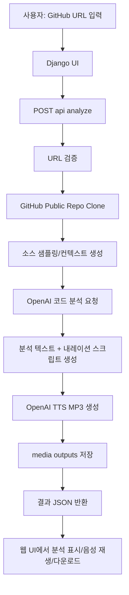
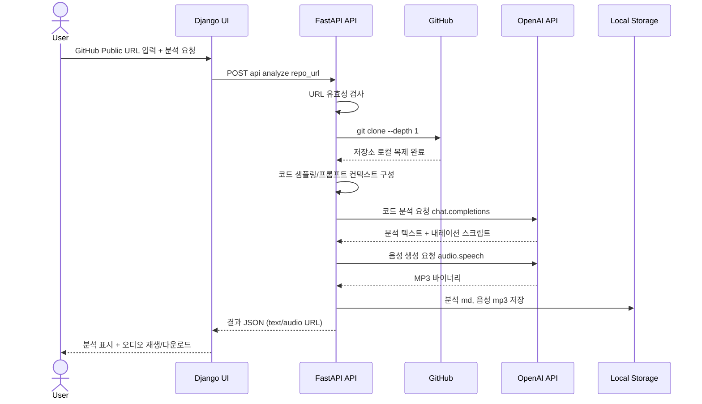

# Django + FastAPI GitHub Repo Voice Analyzer

입력한 GitHub public 저장소 URL을 기준으로:
1. 저장소를 로컬 폴더에 클론
2. OpenAI로 코드 구조/기술 내용을 분석
3. 분석 내용을 OpenAI TTS로 MP3 파일 생성

을 자동 처리하는 웹 애플리케이션입니다.

## 프로젝트 개요
- 목적: 개발자가 GitHub 공개 저장소를 빠르게 이해할 수 있도록 코드 분석 결과를 텍스트와 음성으로 제공
- 입력: GitHub public 저장소 URL (`https://github.com/{owner}/{repo}`)
- 처리: 저장소 클론, 핵심 파일 샘플링, LLM 기술 분석, 내레이션 스크립트 생성, MP3 변환
- 출력: 분석 텍스트(`.md`)와 음성 파일(`.mp3`), 웹 UI에서 재생/다운로드 링크 제공

## 기술 스택
- Language: `Python 3`
- Web UI: `Django`
- API Layer: `FastAPI`
- ASGI Server: `Uvicorn`
- AI Analysis/TTS: `OpenAI API` (`chat.completions`, `audio.speech`)
- Repo Ingestion: `git clone --depth 1`
- Config: `.env`, `python-dotenv`
- Storage: 로컬 파일시스템 (`workspace_repos/`, `media/outputs/`)

## 아키텍처
- `Django`: 웹 화면(UI) 제공
- `FastAPI`: `/api/*` 분석 API 제공
- `OpenAI API`: 코드 분석 + 음성 생성

FastAPI 앱에서 Django ASGI 앱을 `/`에 마운트해 단일 서버로 실행합니다.

## Mermaid Flow


## Mermaid Sequence


## 프로젝트 구조
```text
repo_voice_analyzer/
  settings.py
  urls.py
  asgi.py
  fastapi_app.py
dashboard/
  views.py
  urls.py
  templates/dashboard/index.html
services/
  pipeline.py
manage.py
requirements.txt
.env.example
```

## 설치
```bash
python3 -m venv .venv
source .venv/bin/activate
pip install -r requirements.txt
cp .env.example .env
```

`.env`에서 `OPENAI_API_KEY`를 반드시 설정하세요.

## 실행
```bash
uvicorn repo_voice_analyzer.fastapi_app:app --reload --host 0.0.0.0 --port 8000
```

## Docker 실행
`.env`를 준비한 뒤 Docker Compose로 실행할 수 있습니다.

```bash
cp .env.example .env
# .env 파일에서 OPENAI_API_KEY 설정
docker compose up -d --build
```

중지:
```bash
docker compose down
```

브라우저:
- UI: `http://127.0.0.1:8000/`
- Health: `http://127.0.0.1:8000/api/health`
- API Docs: `http://127.0.0.1:8000/docs`

## API 예시
`POST /api/analyze`

요청:
```json
{
  "repo_url": "https://github.com/openai/openai-python"
}
```

응답:
```json
{
  "job_id": "f0f6aee245e644f2a7a7f513b7ea7ac1",
  "repository": "openai/openai-python",
  "local_path": "/home/Python-Google-TTS/workspace_repos/openai__openai-python__f0f6aee2",
  "analysis_text": "...",
  "narration_text": "...",
  "audio_url": "/media/outputs/f0f6aee245e644f2a7a7f513b7ea7ac1.mp3",
  "analysis_url": "/media/outputs/f0f6aee245e644f2a7a7f513b7ea7ac1.md"
}
```

## 동작 흐름
1. GitHub URL 유효성 검사 (`github.com/{owner}/{repo}`만 허용)
2. `git clone --depth 1`로 로컬 폴더 생성/클론
3. 코드 파일 일부를 샘플링해 프롬프트 컨텍스트 구성
4. OpenAI 모델로 기술 분석 + TTS용 내레이션 생성
5. OpenAI 음성 API로 MP3 파일 생성
6. `/media/outputs`에 분석 문서/오디오 저장

## 주의사항
- public 저장소만 지원합니다.
- 저장소가 너무 크면 분석 시간이 길어질 수 있습니다.
- OpenAI API 사용 비용이 발생할 수 있습니다.
