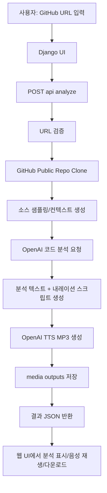
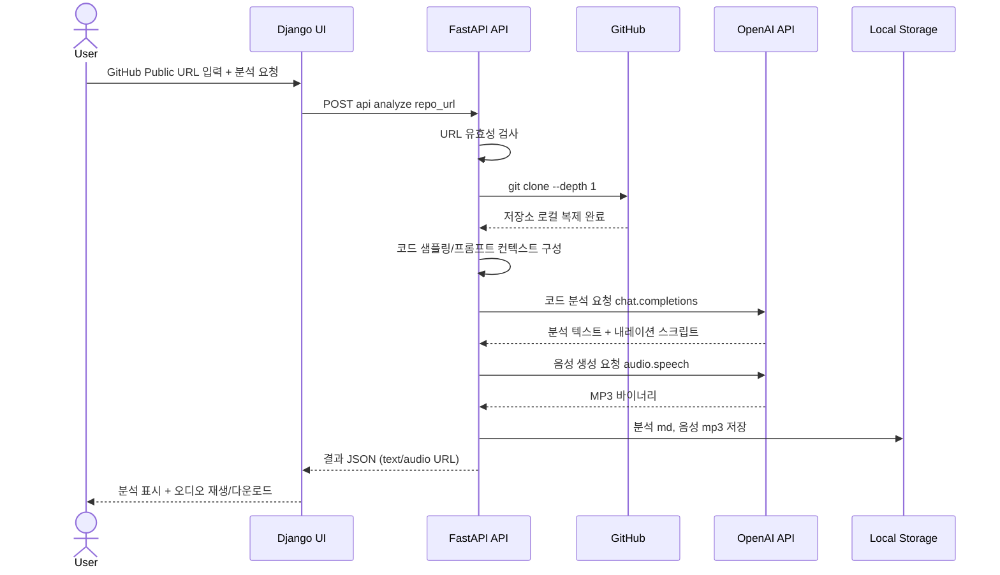
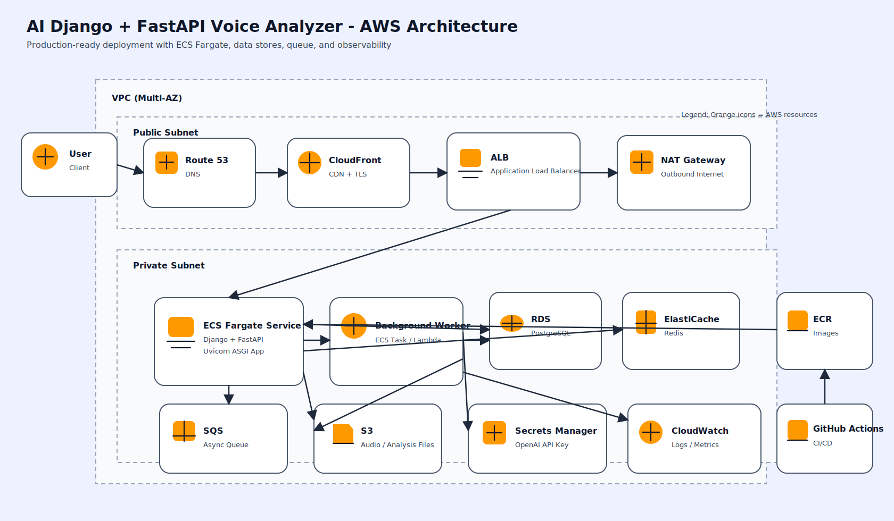

# Django + FastAPI GitHub Repo Voice Analyzer

입력한 GitHub public 저장소 URL을 기준으로:
1. 저장소를 로컬 폴더에 클론
2. OpenAI로 코드 구조/기술 내용을 분석
3. 분석 내용을 OpenAI TTS로 MP3 파일 생성

을 자동 처리하는 웹 애플리케이션입니다.

## 프로젝트 개요
- 목적: 개발자가 GitHub 공개 저장소를 빠르게 이해할 수 있도록 코드 분석 결과를 텍스트와 음성으로 제공
- 입력: GitHub public 저장소 URL (`https://github.com/{owner}/{repo}`)
- 처리: 저장소 클론, 핵심 파일 샘플링, LLM 기술 분석, 내레이션 스크립트 생성, MP3 변환
- 출력: 분석 텍스트(`.md`)와 음성 파일(`.mp3`), 웹 UI에서 재생/다운로드 링크 제공

## 기술 스택
- Language: `Python 3`
- Web UI: `Django`
- API Layer: `FastAPI`
- ASGI Server: `Uvicorn`
- AI Analysis/TTS: `OpenAI API` (`chat.completions`, `audio.speech`)
- Repo Ingestion: `git clone --depth 1`
- Config: `.env`, `python-dotenv`
- Storage: 로컬 파일시스템 (`workspace_repos/`, `media/outputs/`)

## 아키텍처
- `Django`: 웹 화면(UI) 제공
- `FastAPI`: `/api/*` 분석 API 제공
- `OpenAI API`: 코드 분석 + 음성 생성

FastAPI 앱에서 Django ASGI 앱을 `/`에 마운트해 단일 서버로 실행합니다.

## Mermaid Flow


## Mermaid Sequence


## 프로젝트 구조
```text
repo_voice_analyzer/
  settings.py
  urls.py
  asgi.py
  fastapi_app.py
dashboard/
  views.py
  urls.py
  templates/dashboard/index.html
services/
  pipeline.py
manage.py
requirements.txt
.env.example
```

## 설치
```bash
python3 -m venv .venv
source .venv/bin/activate
pip install -r requirements.txt
cp .env.example .env
```

`.env`에서 `OPENAI_API_KEY`를 반드시 설정하세요.

## 실행
```bash
uvicorn repo_voice_analyzer.fastapi_app:app --reload --host 0.0.0.0 --port 8000
```

## Docker 실행
`.env`를 준비한 뒤 Docker Compose로 실행할 수 있습니다.

```bash
cp .env.example .env
# .env 파일에서 OPENAI_API_KEY 설정
docker compose up -d --build
```

중지:
```bash
docker compose down
```

브라우저:
- UI: `http://127.0.0.1:8000/`
- Health: `http://127.0.0.1:8000/api/health`
- API Docs: `http://127.0.0.1:8000/docs`

## API 예시
`POST /api/analyze`

요청:
```json
{
  "repo_url": "https://github.com/openai/openai-python"
}
```

응답:
```json
{
  "job_id": "f0f6aee245e644f2a7a7f513b7ea7ac1",
  "repository": "openai/openai-python",
  "local_path": "/home/Python-Google-TTS/workspace_repos/openai__openai-python__f0f6aee2",
  "analysis_text": "...",
  "narration_text": "...",
  "audio_url": "/media/outputs/f0f6aee245e644f2a7a7f513b7ea7ac1.mp3",
  "analysis_url": "/media/outputs/f0f6aee245e644f2a7a7f513b7ea7ac1.md"
}
```

## 동작 흐름
1. GitHub URL 유효성 검사 (`github.com/{owner}/{repo}`만 허용)
2. `git clone --depth 1`로 로컬 폴더 생성/클론
3. 코드 파일 일부를 샘플링해 프롬프트 컨텍스트 구성
4. OpenAI 모델로 기술 분석 + TTS용 내레이션 생성
5. OpenAI 음성 API로 MP3 파일 생성
6. `/media/outputs`에 분석 문서/오디오 저장

## 주의사항
- public 저장소만 지원합니다.
- 저장소가 너무 크면 분석 시간이 길어질 수 있습니다.
- OpenAI API 사용 비용이 발생할 수 있습니다.

---

# AWS 배포 아키텍처 가이드 (Voice Analyzer)

이 문서는 **AI-Django-FastAPI-GitHub-Repo-VoiceAnalyzer**를 AWS에 안정적으로 배포하기 위해 필요한 리소스와 권장 구성을 정리한 문서입니다.

---

## 1) 권장 AWS 아키텍처 구성도

아래 SVG 구성도는 AWS 리소스 아이콘이 또렷하게 보이도록 제작했습니다.



```mermaid
flowchart TB
    U[사용자/클라이언트] --> R53[Route 53\nDNS]
    R53 --> CF[CloudFront\nCDN + TLS]
    CF --> ALB[Application Load Balancer\nHTTPS 종료]

    subgraph VPC[VPC (멀티 AZ)]
      direction TB

      subgraph PUB[Public Subnet]
        ALB
        NAT[NAT Gateway]
      end

      subgraph PRI[Private Subnet]
        ECS[ECS Fargate Service\n(Django + FastAPI 컨테이너)]
        WKR[Background Worker\n(ECS/Lambda)]
      end

      ALB --> ECS
      ECS --> ElastiCache[(ElastiCache Redis\n캐시/큐 브로커)]
      ECS --> RDS[(RDS PostgreSQL\n메타데이터/서비스 데이터)]
      ECS --> S3[(S3\n음성 원본/분석 결과/정적 파일)]
      ECS --> SM[Secrets Manager\nOpenAI/API 키]
      ECS --> CW[CloudWatch Logs/Metrics]
      WKR --> SQS[SQS\n비동기 작업 큐]
      ECS --> SQS
      WKR --> S3
      WKR --> RDS
    end

    ECR[ECR\n컨테이너 이미지] --> ECS
    GH[GitHub Actions\nCI/CD] --> ECR
    GH --> ECS

    S3 --> CF
```

---

## 2) 리소스별 역할 정리

### 네트워크/엣지
- **Route 53**: 도메인/서브도메인 라우팅.
- **CloudFront**: 전역 캐시, TLS, 정적 콘텐츠 가속.
- **ALB**: HTTPS 트래픽 수신 후 Django/FastAPI 앱으로 전달.
- **VPC + 멀티 AZ + 서브넷 분리**: 보안성과 가용성 확보.

### 애플리케이션 실행
- **ECS Fargate**: 서버 관리 없이 컨테이너 실행.
  - 컨테이너 1: Django (웹/템플릿/관리)
  - 컨테이너 2: FastAPI (API/모델 추론)
  - 필요 시 하나의 이미지에 프로세스 분리도 가능하나, 운영 측면에서 서비스 분리가 유리.
- **ECR**: 버전별 이미지 저장소.

### 데이터/스토리지
- **RDS PostgreSQL**: 사용자/분석 이력/업무 데이터.
- **S3**: 업로드 음성 파일, 변환 MP3, 분석 결과(JSON/CSV), Django 정적 파일.
- **ElastiCache Redis**: 캐시, 세션, Celery 브로커/결과 백엔드.
- **SQS (선택 권장)**: 음성 분석 파이프라인 비동기 큐.

### 보안/운영
- **Secrets Manager**: OpenAI 키, DB 비밀번호, OAuth 비밀값.
- **IAM Role**: ECS Task 최소권한 원칙 적용.
- **CloudWatch**: 로그/메트릭/알람.
- **AWS WAF (선택)**: 웹 공격 차단.
- **AWS Backup (선택)**: RDS 스냅샷 및 복구 정책.

### CI/CD
- **GitHub Actions**:
  1. 테스트/빌드
  2. Docker 이미지 생성
  3. ECR 푸시
  4. ECS 서비스 업데이트(롤링 배포)

---

## 3) 기술 스택 (배포 관점)

### 애플리케이션
- **Python**
- **Django** (웹/관리 화면)
- **FastAPI** (고성능 API)
- **Uvicorn/Gunicorn** (ASGI/WSGI 런타임)

### AI/오디오 처리
- **OpenAI API 연동** (음성/텍스트 분석)
- **커스텀 파이프라인 (`services/pipeline.py`)**

### 인프라/운영
- **Docker / Docker Compose (로컬 개발)**
- **AWS ECS Fargate + ECR**
- **RDS PostgreSQL / S3 / ElastiCache Redis / SQS**
- **CloudFront / Route 53 / ALB / VPC**
- **CloudWatch / Secrets Manager / IAM / (선택) WAF**

### CI/CD
- **GitHub Actions** 기반 빌드/배포 자동화

---

## 4) 권장 배포 전략

- **Blue/Green 또는 Rolling 배포**를 기본으로 사용.
- `main` 브랜치 머지 시 자동 배포, `develop`은 스테이징으로 배포.
- 헬스체크(`/health`) 기반 무중단 배포.
- 장애 대비:
  - RDS 멀티 AZ
  - S3 버저닝
  - CloudWatch 알람 + 자동 롤백

---

## 5) 최소 체크리스트

- [ ] 도메인/인증서(ACM) 연결 완료
- [ ] ECS Task Definition에 환경변수/시크릿 연결 완료
- [ ] S3 버킷 권한 및 수명주기 정책 설정
- [ ] RDS 보안그룹(애플리케이션 서브넷에서만 접근) 설정
- [ ] CloudWatch 알람(CPU, 메모리, 5xx, 지연시간) 설정
- [ ] CI/CD 배포 롤백 절차 문서화

이 구성을 기반으로 시작하면, 현재 레포의 Django + FastAPI + 오디오 분석 워크로드를 운영 환경에 맞게 확장 가능하고 안전하게 배포할 수 있습니다.
